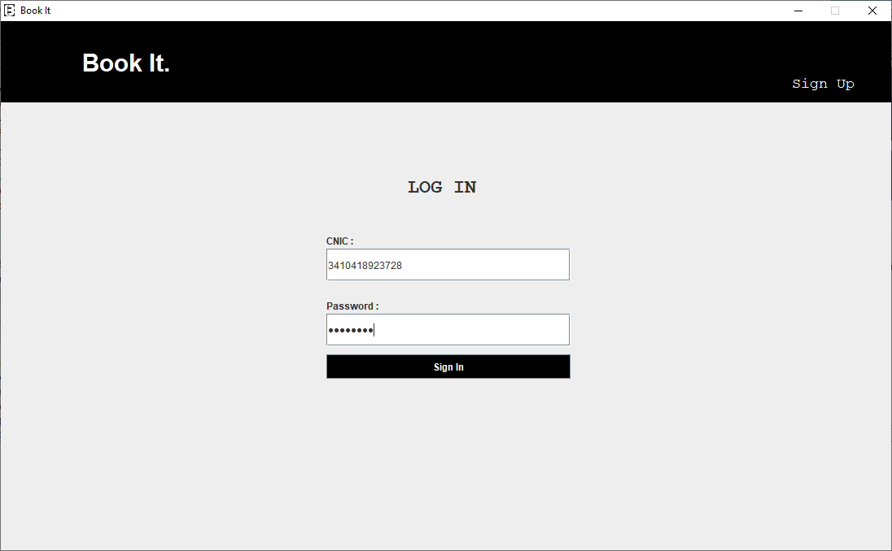
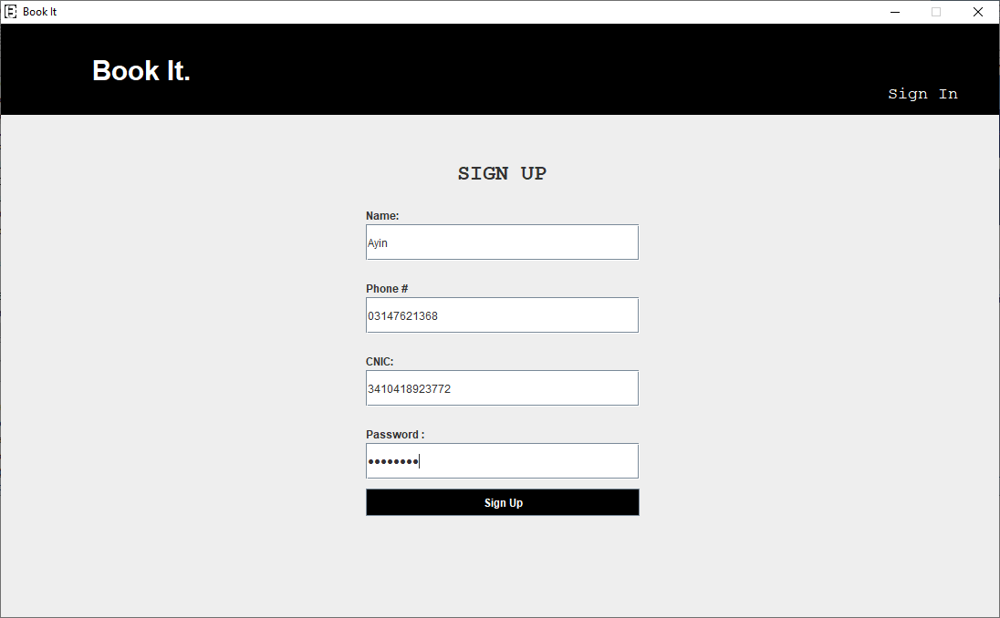
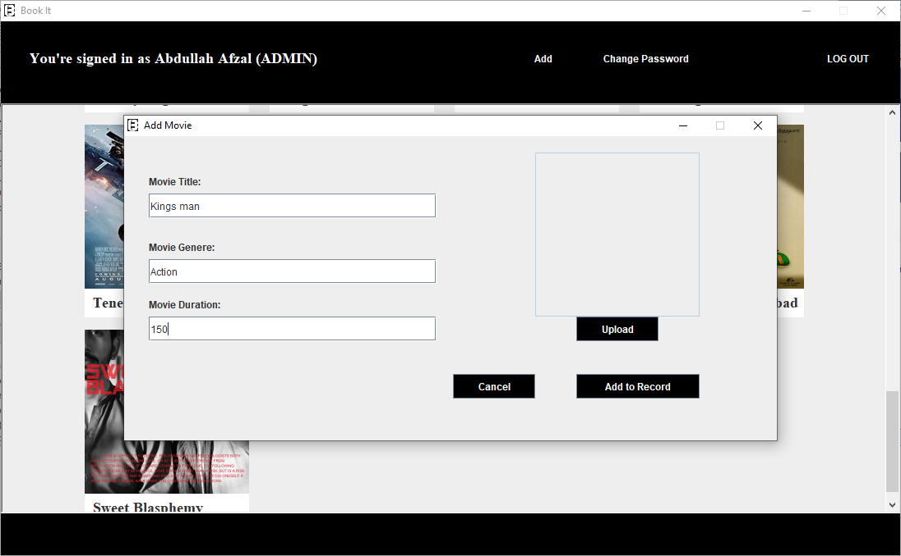
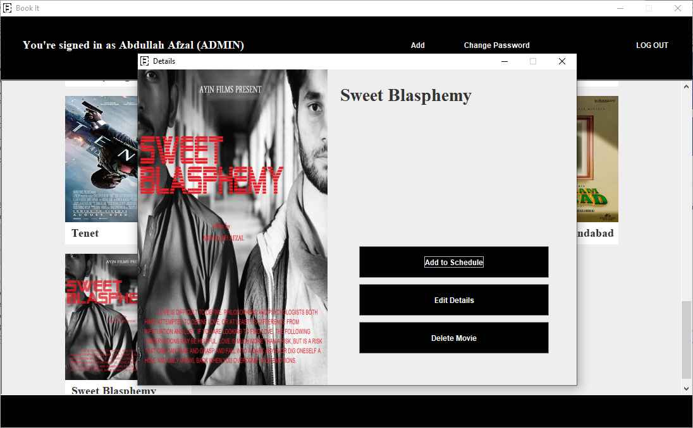

# BookIt - Cinema_Ticket_Booking_System

It is a Java desktop application, a cinema ticket booking system, in which a user can book some movies. And the movies will be scheduled according to dates. And only one movie can be scheduled at a specific time in a hall. There will also be a record of seats in the system. And only limited users can book seats at a specific schedule. Many movies can be scheduled at a different schedule. Each user will sign up and then log in to enter the system. User can see and book movies as many as want. Each user has a dashboard in which it can see booked movies. There can be multiple admins of the systems. They can add, remove, update, and schedule the movies. In order to schedule the movies, if time overlaps or the scheduled date is in past dates, then the admin will be prompted to schedule movies invalid time and date.

# Screenshots
Folowing are four screenshots showing the design of system.

Login Page
--
</img>

SignUp Page
--
</img>

Adding new Movie Page
--
</img>

Add Schedule Page
--
</img>

## Usage

```
1. Clone full project
2. import .sql file to your db (optional)
3. open project in an IDE like netbeans

```
---

Any tips on how it can be better or suggestions are appreciated.
Contact at: mr.abdullahAfzal@gmail.com
